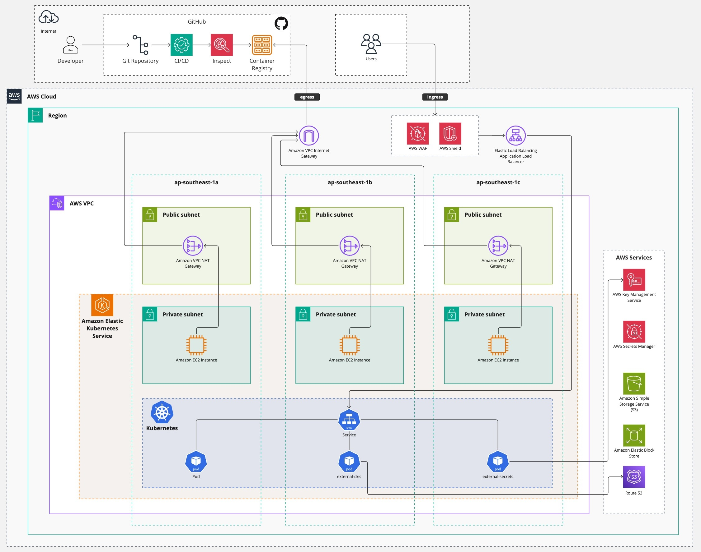
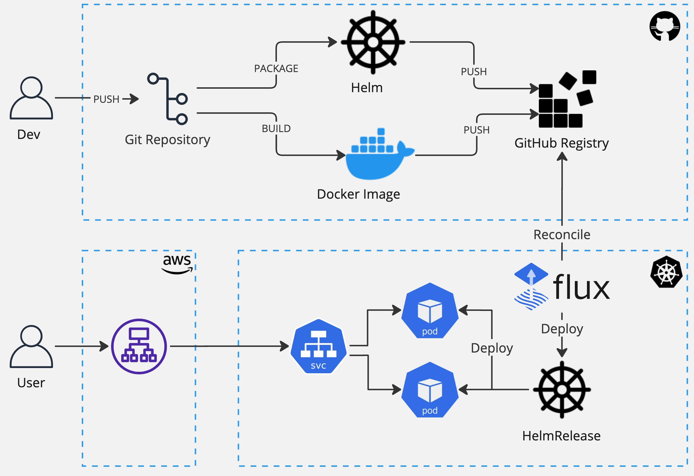

# Quasar Project

The reference deployment for a High-Availability (HA) web application, incorporating best practices in security and
delivery through Continuous Integration/Continuous Deployment (CI/CD).

## Project structure

```
.
├── app
│   └── quasar-app
│       └── templates
├── docs
│   └── images
├── helm
│   └── templates
│       └── tests
├── k8s
│   ├── apps
│   │   └── quasar-app
│   │       ├── base
│   │       └── overlays
│   │           ├── dev
│   │           └── prod
│   ├── clusters
│   │   └── dev
│   │       ├── apps
│   │       ├── infra
│   │       ├── namespaces
│   │       ├── repositories
│   │       └── secrets
│   ├── environments
│   │   └── 01-quasar-dev
│   │       └── flux-system
│   └── infra
│       ├── alb-controller
│       │   ├── base
│       │   └── overlays
│       │       └── dev
│       ├── external-secrets
│       │   ├── base
│       │   └── overlays
│       │       └── dev
│       └── metrics-server
│           ├── base
│           └── overlays
│               └── dev
├── terraform
│   ├── environments
│   │   └── 01-quasar-dev
│   └── modules
│       ├── terraform-aws-eks
│       │   └── examples
│       ├── terraform-aws-iam
│       ├── terraform-aws-vpc
│       │   └── examples
│       └── terraform-context
│           └── example

```

## Architecture overview



## Requirements

Ensure that the following prerequisites are met:

- Terraform installed (version 1.6.X)
- Kubernetes CLI (kubectl) installed
- FluxCD CLI installed
- Access to the AWS cloud provider

## Features

### Application

- [x] Docker Image multistaging build
- [x] Helm chart packaging

### Terraform

- [ ] Terraform IAM module
- [x] Terraform VPC module
- [x] Terraform EKS module
- [x] Terraform Context module
- [ ] Terraform ALB module
- [ ] Terraform AWS Shield module

### Kubernetes

- [x] FluxCD integration
- [ ] Integration with external Secret Manager
- [ ] Integration with external DNS provider
- [ ] Service mesh integration

### CI/CD

- [x] GitHub Actions integration
- [x] Pulling images and helm charts from OCI Docker Registry (GitHub)
- [x] Integration with GitVerion tool
- [x] Support multi-deployment and multi-staging configuration
- [ ] Scan Docker images for vulnerabilities
- [ ] Static code analysis

## Deployment workflow



## Development

For development purposes, all components can be built and deployed separately to have a more frequent development cycle.

### Apply Terraform scripts

```bash
cd terraform/environments/01-quasar-dev
terraform init
terraform plan
terraform apply
```

### Configure access to the EKS cluster

```bash
aws eks update-kubeconfig --region ap-southeast-1 --name eks-1-quasar-dev
```

### Bootstrap FluxCD

```bash
flux bootstrap github \
         --owner=maggnus \
         --repository=quasar-project \
         --path ./k8s/environments/01-quasar-dev \
         --components-extra=image-reflector-controller,image-automation-controller
```

## Authors

- [@maggnus](https://www.github.com/maggnus)

